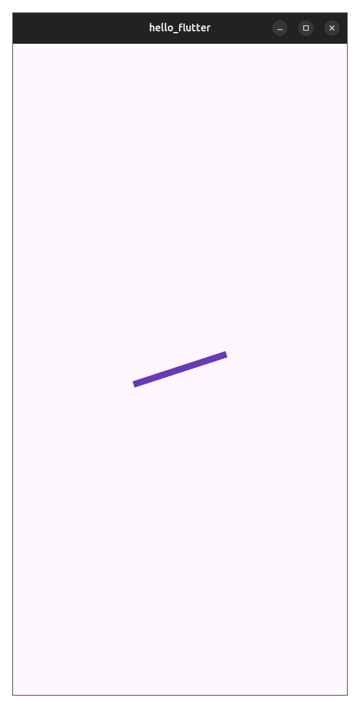

# RotationTransition Flutter Demo

## Description
This is a small Flutter demo showing how the RotationTransition widget can rotate a widget on the screen. In this example, a purple bar rotates continuously in the center of the screen. This could be used as a simple loading indicator.

## How to Run
1. Clone the repository
2. Run `flutter pub get`
3. Run `flutter run`

## Widget
RotationTransition

## Three Properties Demonstrated

**turns**  
Controls how much the widget rotates. In this demo it is connected to an AnimationController so the bar keeps rotating.

**child**  
The widget that rotates. In this app, the child is a Container that creates the purple bar.

**alignment**  
Controls the point the widget rotates around. By default it rotates around the center.

## Screenshot

